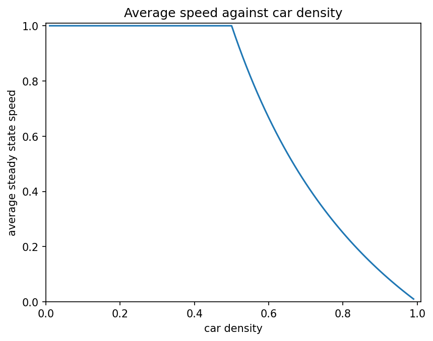

# Simulation Projects

Some smaller simulation projects I did in Python for my Computational Physics degree at the University of Edinburgh.

- traffic-flow - a cellular automaton model of cars on a circular road
- mandelbrot - plots the Mandelbrot set

My bigger project, a simulation of the solar system, is in a separate repo: [Solar-system-simulation](https://github.com/mark-152-w/Solar-system-simulation)

Both need numpy and matplotlib:

```
pip install -r requirements.txt
```

 
