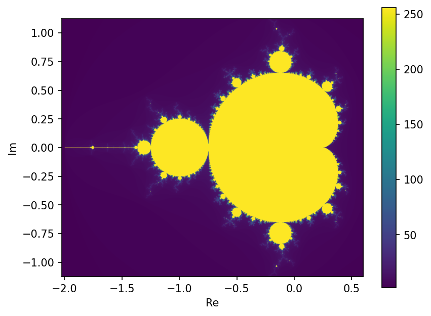

# Mandelbrot set

Plots the Mandelbrot set. For each point c on a grid in the complex plane it repeats z = z^2 + c starting from z = 0, until either |z| gets to 2 (then it's going to diverge) or it hits 255 iterations. The colour is the number of iterations it took.



## Running it

```
python Mandelbrot_Run.py
```

To zoom in on a different region, change the numbers in Mandelbrot_Run.py. The arguments are (real_min, real_max, im_min, im_max, step).
