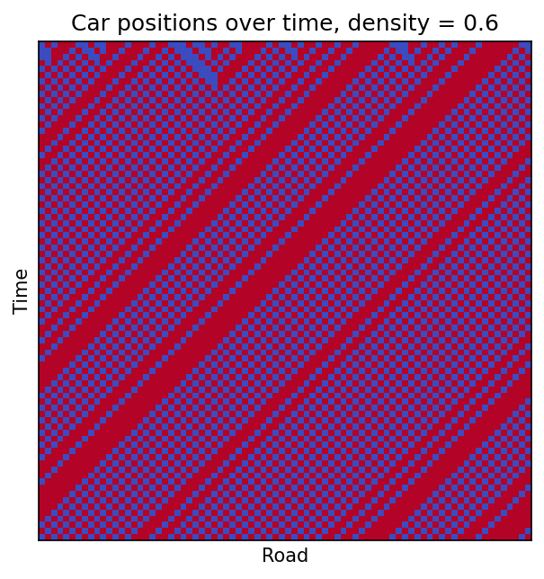

# Traffic flow

A simple model of traffic on a circular road. The road is split into n cells and each cell either has a car in it or is empty. Every timestep, any car with an empty cell in front of it moves forward one cell, and all the cars update at the same time. (This is the same as the Rule 184 cellular automaton.)

The program does two things:

1. Shows the positions of the cars over time for the density you give it
2. Runs the model until it reaches a steady state for every density from 1/n up to 1, and plots the average speed against density

Positions over time at a density of 0.6. You can see the jams (the solid bands) moving backwards along the road:



Average steady state speed against density:


Below a density of 0.5 every car can move every step so the average speed is 1. Above 0.5 the speed drops off, following (1 - density)/density.

## Running it

```
python traffic.py
```

It asks for the number of cells, the car density (between 0 and 1) and the number of iterations, e.g. 100, 0.6, 100.
